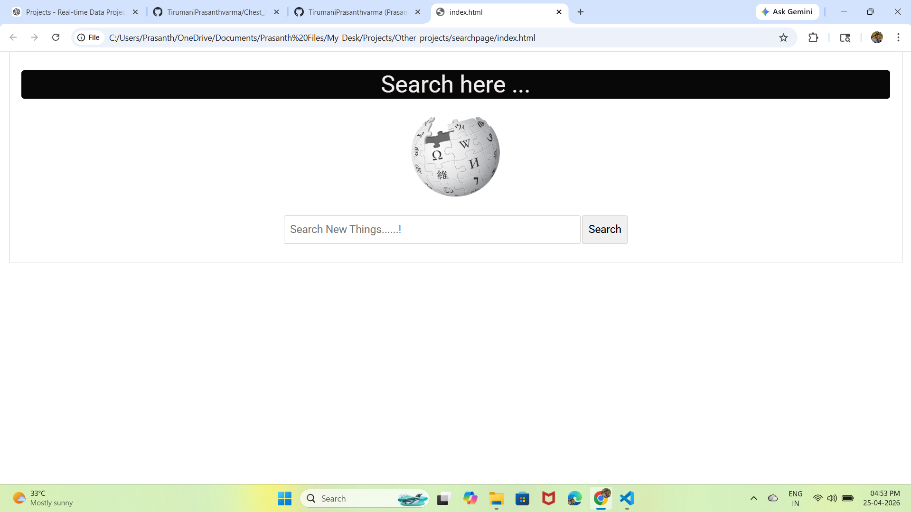
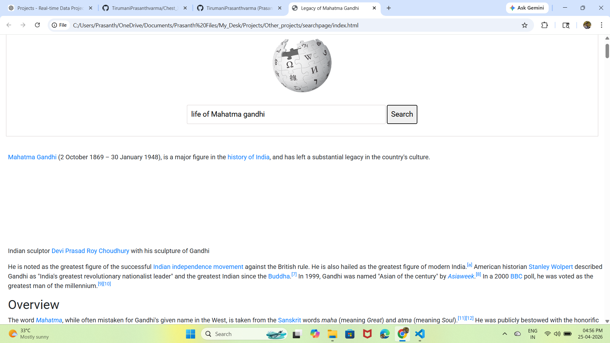

# 🔍 Wikipedia Search Website

## 📌 Project Overview

This project is a simple **Wikipedia Search Website** built using **HTML, CSS, and JavaScript**. It allows users to search any topic and directly view related Wikipedia content in a clean and easy-to-use interface.

The project was created as a practical learning exercise and also to help students quickly find educational information online.

---

## 🎯 Objective

The main objective of this project was to build a functional search website that fetches useful content directly from Wikipedia, making it easier for users to access information instantly.

---

## 🛠️ Technologies Used

- **HTML** – Structure of the webpage  
- **CSS** – Styling and layout design  
- **JavaScript** – Search functionality and redirection logic  

---

## 📊 Features

✔ Clean and simple user interface  
✔ Search any topic instantly  
✔ Redirects to relevant Wikipedia page  
✔ Fast and lightweight design  
✔ Beginner-friendly project structure  
✔ Responsive search layout  

---

## 🚀 How It Works

1. User enters a keyword in the search bar  
2. Clicks the **Search** button  
3. The website opens the related Wikipedia page or search results instantly

Example:

- Search `Facebook`
- Redirects to Facebook Wikipedia page

---

## 💡 Use Cases

- Students searching educational topics  
- Quick knowledge lookup  
- School mini projects  
- Learning front-end web development basics  

---
# 📷 Interface Preview






## 📁 Project Structure

```text
Wikipedia-Search-Website/
│── index.html
│── style.css
│── script.js
│── images/